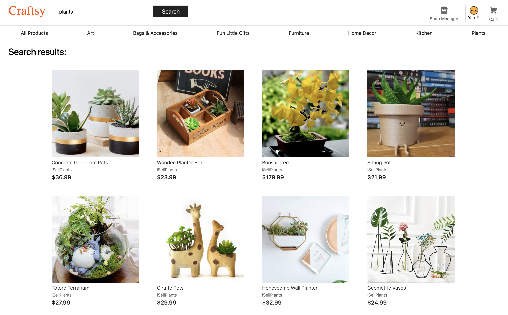

# Craftsy

Craftsy is a curated marketplace for unique and handcrafted goods inspired by Etsy. Users can both browse listings and purchase products, as well as set up shop themselves.

[Explore Craftsy here!](http://craftsy.peterzeng.io/)

## Technologies

- React
- Redux
- Ruby on Rails
- JavaScript
- PostgreSQL
- Amazon Web Services S3
- HTML
- CSS

## Features

Craftsy was built with a focus on creating a seamless shopping experience. Below you'll find a few highlights that showcase this philosophy.

### _Demo Account & Persistent Shopping Cart_

Users are able to access the full functionality of this portfolio site without having to register for an account themselves, simply by clicking on the demo login.

Once logged in, users are able to add items to their shopping cart and have them persist until they are ready to checkout, whether that's in the next hour or the next day. No matter, products added to your cart will be there when you log back in.

### _Convenient Search Bar_

If you already have an idea of what you'd like to purchase, go ahead and just type into the search bar. There's no need to browse through all of the categories to find what you're looking for.

### _Intuitive Shopping Functionality_

Browse popular product categories using the the navigation bar. Once a product catches your eye, check out the reviews at the bottom of the product page before finalizing your purchase. If you realize during the checkout process that you have the incorrect quantity, edit the number right there in your shopping cart and you're all set!

